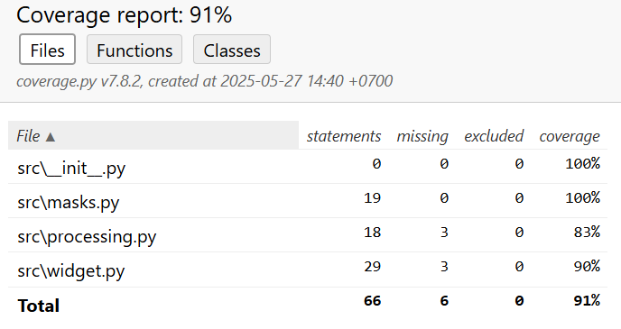

# Проект ФИЧА

## Описание:

Проект ФИЧА - это виджет, который показывает несколько последних успешных 
банковских операций клиента. Конкретно на бэкенде он будет готовить данные для отображения 
в новом виджете. На данном этапе проект содержит готовые функции для маскировки входных данных
по платежным реквизитам от клиента, функцию сортировки операций по дате, и функцию фильтрации
по статусу операции по счету.

## Установка:

1. Запустите PyCharm на вашем компьютере

2. Клонируйте репозиторий:
```
https://github.com/korklin/PythonProject1.git
```
3. В главном меню PyCharm перейдите в меню Get from VCS. Вставьте ссылку на репозиторий и нажмите на кнопку Clone.

## Использование:

Чтобы ознакомиться с работой функции маскировки номера карты клиента, нужно выбрать файл masks.py и вызвать в нем функцию
get_mask_card_number() с нужными вам данными. 

Пример работы функции:
```
7000792289606361     # входной аргумент
7000 79** **** 6361  # выход функции 
```
Чтобы ознакомиться с работой функции маскировки номера счета клиента, в том же файле вызовите функцию get_mask_account() с нужными вам данными.

Пример работы функции:
```
73654108430135874305  # входной аргумент
**4305  # выход функции
```
Для функций get_mask_card_number() и get_mask_account() в файле test_masks.py проведены тестирования, включающие проверку на несоответствие длины номера карты/счета и
на нестандартный ввод с некорректными символами. В случае ошибки вызывается ValueError.

Чтобы ознакомиться с работой функции фильтрации по статусу операции по счету, выберите файл processing.py
и вызовите функцию filter_by_state(). Для вызова вам понадобятся входные данные, которые вы можете скопировать ниже:
```
[{'id': 41428829, 'state': 'EXECUTED', 'date': '2019-07-03T18:35:29.512364'}, {'id': 939719570, 'state': 'EXECUTED', 'date': '2018-06-30T02:08:58.425572'}, {'id': 594226727, 'state': 'CANCELED', 'date': '2018-09-12T21:27:25.241689'}, {'id': 615064591, 'state': 'CANCELED', 'date': '2018-10-14T08:21:33.419441'}]
```
Также необходимо задать значение для ключа state (по умолчанию 'EXECUTED').
Пример работы функции:
```
# Выход функции со статусом по умолчанию 'EXECUTED'
[{'id': 41428829, 'state': 'EXECUTED', 'date': '2019-07-03T18:35:29.512364'}, {'id': 939719570, 'state': 'EXECUTED', 'date': '2018-06-30T02:08:58.425572'}]

# Выход функции, если вторым аргументов передано 'CANCELED'
[{'id': 594226727, 'state': 'CANCELED', 'date': '2018-09-12T21:27:25.241689'}, {'id': 615064591, 'state': 'CANCELED', 'date': '2018-10-14T08:21:33.419441'}]
```
В этом же файле можно ознакомиться с работой функции сортировки операций по дате (по умолчанию сортировка назначена по убыванию).
для этого вызовите функцию sort_by_date(). Для вызова вам понадобятся данные, которые вы можете скопировать ниже, а также нужно задать порядок сортировки (True/False):
```
[{'id': 41428829, 'state': 'EXECUTED', 'date': '2019-07-03T18:35:29.512364'}, {'id': 939719570, 'state': 'EXECUTED', 'date': '2018-06-30T02:08:58.425572'}, {'id': 594226727, 'state': 'CANCELED', 'date': '2018-09-12T21:27:25.241689'}, {'id': 615064591, 'state': 'CANCELED', 'date': '2018-10-14T08:21:33.419441'}]
```
В файле test_processing.py проведены тестирования:
- на разные направления сортировки для дат, а также для повторяющихся данных;
- на фильтрации по разным значениям ключа 'state', а также, на пустой результат, при отсутствии подходящего значения ключа.

В файле widget.py можно посмотреть работу функции mask_account_card() по маскировке карты/счета клиента, но уже в более продвинутом варианте.
Пример работы функции:
```
# Пример для карты
Visa Platinum 7000792289606361  # входной аргумент
Visa Platinum 7000 79** **** 6361  # выход функции

# Пример для счета
Счет 73654108430135874305  # входной аргумент
Счет **4305  # выход функции
```
Для вызова функции mask_account_card() вам понадобятся данные, которые вы можете скопировать ниже:
```
Maestro 1596837868705199
Счет 64686473678894779589
MasterCard 7158300734726758
Счет 35383033474447895560
Visa Classic 6831982476737658
Visa Platinum 8990922113665229
Visa Gold 5999414228426353
Счет 73654108430135874305
```
Также в этом файле можно вызвать функцию get_date(), которая преобразует формат даты в более простой и удобный для пользователя.
В файле test_widget.py проведено тестирование функции на обработку некорректных данных ввода даты, и проверка корректного преобразования граничных 
случаев.
Для вызова можете воспользоваться данными ниже:
```
2024-03-11T02:26:18.671407
```
Функция вернет дату в формате "ДД.ММ.ГГГГ"

Информация о покрытии кода тестами:

## Документация:

Для получения той же самой информации обратитесь к [документации](docs/README.md).

## Лицензия:

Этот проект еще не лицензирован.